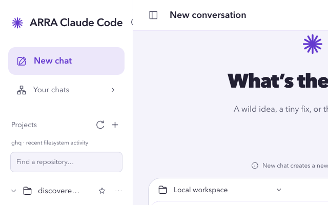
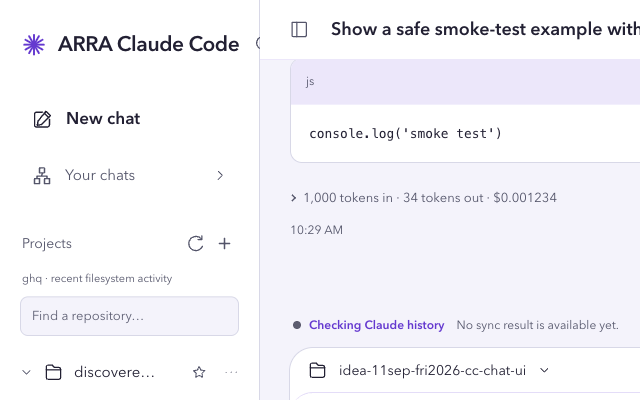
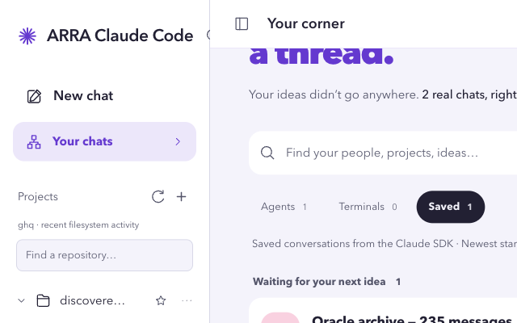
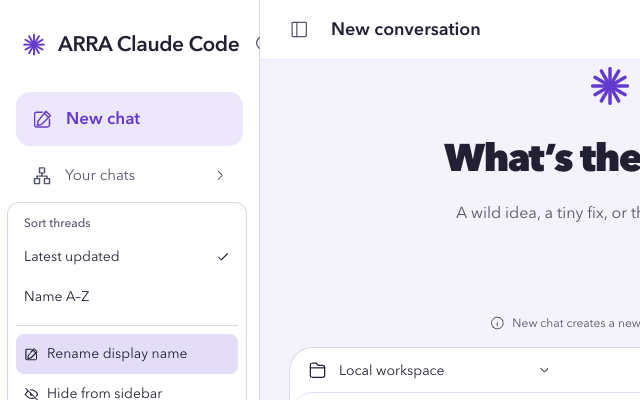
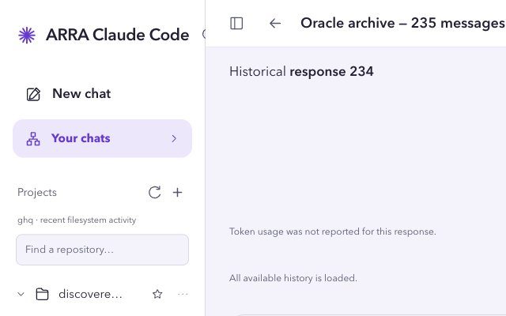
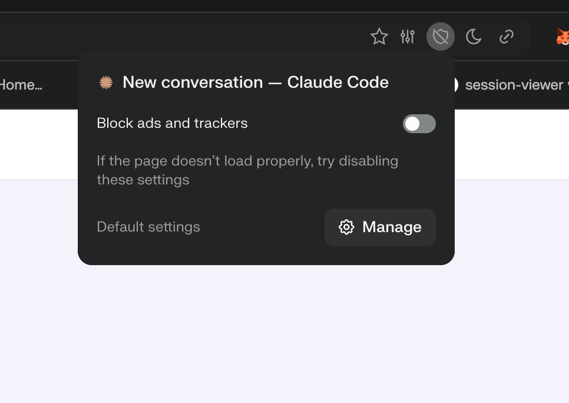

# ARRA Claude Code

A Codex-inspired chat UI for Claude Code on your Mac. Real sessions, repository threads, and streaming replies.



**[Explore features →](docs/features.md)** · [Tutorial](docs/tutorials/using-claude-code-chat-ui.md) · [Deployment](docs/cloudflare.md) · [Mobile view](docs/images/token-usage-mobile.png)

## See it in action

| Stream a reply | Pick up a saved session |
| --- | --- |
|  |  |

| Organize each project | Load the whole conversation |
| --- | --- |
|  |  |

**[Open the full visual walkthrough →](docs/tutorials/using-claude-code-chat-ui.md)**

## Quick start

Requires Node.js supported by Vite 8 and Claude Code installed on your Mac. From this cloned repository:

```sh
claude auth login
npm ci
npm run dev
```

Open **http://127.0.0.1:5173**. Keep the backend running.

> **Full access is on by default.** Claude can modify files and run commands without asking. Use trusted projects, or select **Default permissions**. Never expose the unauthenticated backend publicly.

## Use the hosted UI

```sh
CC_CHAT_FRONTEND_ORIGIN=https://cc-chat-ui.laris.workers.dev npm start
```

**[Open workspace →](https://cc-chat-ui.laris.workers.dev/?host=http://127.0.0.1:4318)** · Keep the backend running on this Mac. Allow this trusted site’s local-device access when prompted.

Cloudflare hosts the interface; conversations and execution stay on your selected backend. Claude Code still contacts Anthropic. [Setup and security →](docs/cloudflare.md)

## Comet blocking the connection?



**Shield → “Block ads and trackers” off for this site only → Reload.** If it does not help, restore blocking. [Troubleshooting →](docs/cloudflare.md#quick-per-site-fix-the-shield-menu)

## Special thanks

Special thanks to **Pinyo Boy Tanradtanamonthon** for the idea that inspired ARRA Claude Code.

---

[MIT license](LICENSE) · Built with React, TypeScript, Vite, and Tailwind CSS. Independent project—not an official Anthropic or OpenAI app.
