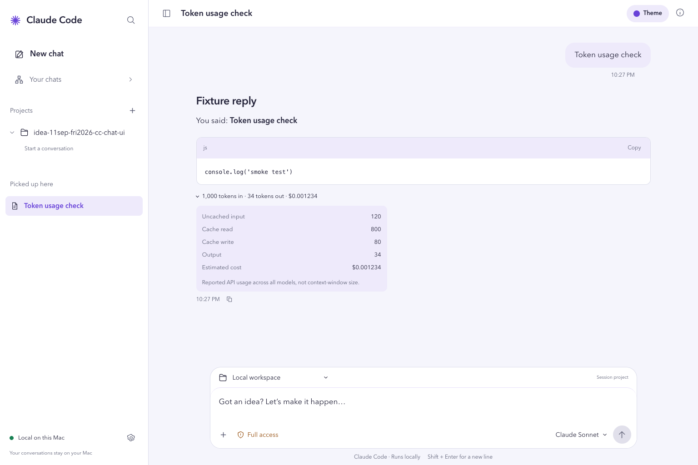
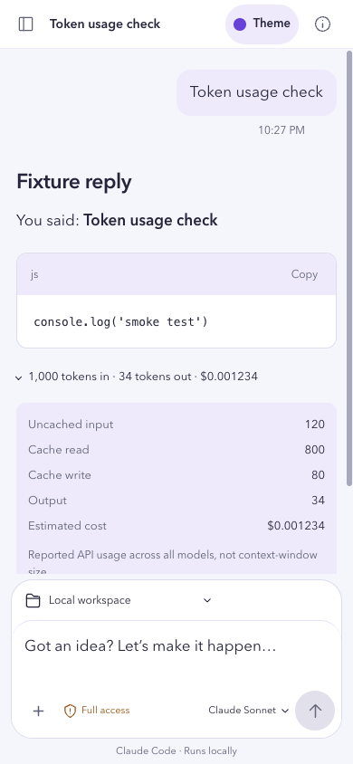

# Claude Code Workspace

A Codex-inspired local chat workspace for your installed Claude Code. Built with React, TypeScript, Vite, and Tailwind CSS, using the layout from [conversation mockup B](.impeccable/mocks/b-oracle-conversation.png), then revised into a brighter personal inbox at the user’s request.

## Run on your Mac

Use a current Node.js version supported by Vite 8, and install/login to Claude Code first (`claude auth login`). This app uses that existing CLI login; it does not copy credentials or require a separate API key.

```sh
npm ci
npm run dev
```

Open **http://127.0.0.1:5173**. The local API runs on port 4318. For a production build:

```sh
npm run build
npm start
```

Then open **http://127.0.0.1:4318**. Keep the terminal running. This is a local web app, not a packaged macOS application.

## What works

- **New chat:** the first message creates a distinct Claude session. Later messages use `claude -p --resume` with that session's UUID.
- **Projects:** add an existing absolute folder path. Claude runs in that directory using its instructions. A started session's project is locked to preserve context.
- **Conversations:** streamed text, compact expandable Activity groups, Stop, model selection, searchable names/messages, Markdown export, and locally saved drafts. Expanded tool rows pair **Command** and **Output** panels, preserve shell text while colorizing tokens, pretty-print JSON, keep plain logs plain, and offer Copy plus a Raw JSON toggle when the original payload differs.
- **URLs and browser history:** chats, native sessions, source tabs, search filters, and new-chat projects have stable `#/…` URLs. Refresh restores the URL; browser Back/Forward restores navigation without sending a prompt.
- **Token usage:** completed replies show reported input/output counts, cache read/write breakdown, and estimated USD cost when Claude supplies it. All-model totals include subagents; older main-agent-only counts and historical per-response counts are labeled separately. Missing usage is labeled unavailable; counts are not context-window estimates.
- **Appearance:** Pop, Light, and Dark themes, plus Comfortable/Larger reading sizes. The Theme control saves browser preferences immediately.
- **Your chats:** a personal inbox with real status filters and project-derived initials—not invented agent portraits or presence. Sidebar destinations stay neutral until current; `aria-current` and one shared selected tint prevent New chat and Your chats from looking active together.
- **Rename:** use Session details or `/rename My session name`. Existing native names are updated through the official Claude Agent SDK, not by rewriting transcript files.
- **Native sessions:** browse three non-overlapping sources: **Agents** shows background jobs from `claude agents --json --all`, **Terminals** shows interactive CLI sessions, and **Saved** shows conversations from the SDK. An attached background job stays in Agents instead of appearing twice. Inspect history, page through longer conversations, and resume inactive sessions here. Active sessions remain read-only; copy their terminal command to continue in Claude Code.
- **Remove from workspace:** removes only this app's chat record, never the native transcript or project files.

The SDK supplies saved session listing, history, and rename. The installed CLI supplies execution and live-agent inventory. Their supported behavior can vary with installed versions.

Within each source, the app sorts by newest reported `startedAt`. Background jobs are grouped as Needs input, Working, Completed, or Unknown state; failed and stopped jobs remain under Completed while retaining their exact status label. This is an explicit approximation of Claude Code's native Agents view because its internal tie-break and ordering key are not exposed.

### Full access

**Full access is enabled by default, as requested.** It adds `--dangerously-skip-permissions`: Claude may change files, run commands, and access services without asking. Use only trusted projects. This app is not a sandbox.

Choose **Default permissions** in the composer to omit that flag. This headless UI cannot display Claude's interactive permission dialogs; requests requiring approval may be denied. Use the terminal for those workflows.

### Agent messaging

`/list-agents` inside Claude discovers eligible messageable peers. Native `ListAgents` and `SendMessage` are Claude runtime tools, **not** public host-side SDK RPC methods. The session inventory is not a list of verified messaging targets. Availability depends on Claude Code's runtime capabilities and recipient policy. This UI does not write private mailboxes or sockets or send peer messages automatically. See [Anthropic's cross-session messaging documentation](https://code.claude.com/docs/en/cross-session-messaging).

### Terminal / TTY

The current Chat stream is structured JSON, **not a TTY**. A real terminal tab is feasible but not implemented; it would need a server-owned PTY, a browser terminal emulator, bidirectional input, and resize/lifecycle handling. `claude attach` applies to supported background jobs, not arbitrary running session UUIDs. See [TTY feasibility and primary sources](.impeccable/research/tty-feasibility.md).

## Local data and boundaries

App metadata and conversation copies are stored in `.local/state.json` (gitignored, owner-only file permissions). Set `CC_CHAT_DATA_DIR` to choose another location. Native transcripts remain under Claude Code's own storage. Keep backups if you need durable archives.

The server binds only to `127.0.0.1`, checks Host/Origin, and rejects cross-origin mutation requests. Do not expose it through a public tunnel, reverse proxy, or shared machine account: it has no multi-user authentication. Local storage does **not** mean offline model execution—Claude Code still communicates with Anthropic using your account.

`/?preview=oracle` is an explicitly labeled, non-executable design preview with illustrative conversations. It does not populate live app data. Oracle registry dates shown there are historical, not live presence.

## Verify

```sh
npm run check  # tests, ESLint, TypeScript, production build
```

For an isolated browser test, run `node scripts/smoke-server.mjs` after building and open `http://127.0.0.1:4319`. It uses temporary fake data; it never invokes Claude.

Tests use fake CLI/SDK adapters; they do not send model requests or mutate personal Claude sessions. The official SDK is the only added runtime integration dependency beyond React.

## References

- [Claude CLI](https://code.claude.com/docs/en/cli-usage), [headless execution](https://code.claude.com/docs/en/headless), [Agent SDK](https://code.claude.com/docs/en/agent-sdk/typescript)
- [Native binary and SDK research](.impeccable/research/claude-sdk-sessions-reference.md)
- [Original proposal](PROPOSAL.md)

Independent interface; not an official Anthropic or OpenAI product.

Born 19:42 +07 from `nat-build-with-oracle/11sep-fri2026-oracle`.

### Known boundaries

- Native discovery is bounded to the newest 500 SDK sessions plus CLI inventory.
- Load all imported history before sending; pages and their cursor are saved in the app store so a reload does not lose them.
- Native ownership checks are snapshots. The app fails closed when ownership cannot be checked, but cannot lock an unrelated external Claude process.
- SDK rename and local app persistence cannot be one cross-store transaction if the local disk fails after a successful native rename.
- Live session discovery/history were verified; execution, rename, cancellation, and error flows were verified with isolated CLI/SDK fixtures, not a billable live inference turn.
- Project choices are the Local workspace plus folders explicitly added to this app. The selector does not browse the filesystem or infer global-versus-project scope.

## Screenshots

The interface is designed to keep local Claude work readable on desktop and mobile:




