# ARRA Claude Code: the complete visual tour

For people using the local web app: create a Claude conversation, organize Oracles, inspect native sessions, and load a long history without losing your place.

[← README](../../README.md) · [Claude login and naming](../claude-code-and-session-names.md) · [Desktop setup](../desktop.md) · [VPN access](../vpn-access.md)

## Before you begin

- Your everyday app is **http://127.0.0.1:4318/#/new**. Start it with the installed menu-bar app or `npm start` after building the frontend.
- **Human-only authentication:** sign in to your own Claude Code account in a terminal if needed. Never paste login codes, provider tokens, or VPN unlock links into screenshots or issue reports.
- Choose **Default permissions** unless you explicitly trust the project and intend to allow unattended changes. **Full access** bypasses Claude permission prompts. Default mode cannot display interactive approval dialogs in this headless UI; use the terminal when a task requires them.

### Reproduce this tour without real conversations or model charges

```sh
npm ci
npm run build
node scripts/smoke-server.mjs
```

Open **http://127.0.0.1:4319/#/new**. This separate server uses temporary fixture data, a fake Claude runner, fake native sessions, and fake naming suggestions. It does not authenticate with Claude, execute the displayed commands, or send prompts to a model. Stop it with `Ctrl+C` when finished. Do not run the fixture server on your real data directory.

**Capture notes:** observed on **13 September 2026**, using the Claude-only UI build `v26.9.13-alpha.1251`, immediately before source release `v26.9.13-alpha.1324`. The 20 images below are complete browser-window/app-viewport captures, not a stitched image of every message in a virtualized conversation. Browser full-page capture timed out, so native window capture was used instead. All session IDs and conversations shown are synthetic; filesystem paths identify only the public repository or disposable fixtures.

**Fixture limitation:** its generated replies do not create real Claude JSONL files. The chat screenshots therefore show **Checking Claude history / No sync result is available yet** even after the fake reply finishes. That is not proof of a successful live history sync. Use a **new chat** for each fixture prompt; trying to resume a generated fake session can show **Native Claude session not found**. The separate 235-message archive supports history browsing.

## Steps

### 1. Recognize the workspace

Open **New chat** at `http://127.0.0.1:4319/#/new`.

- **Expected result:** the sidebar shows **Your chats**, **Live Timeline**, project search, and the selected **Backend** address. The footer exposes the UI version and build details.
- Confirm `4319` for this tutorial, not your everyday `4318` service. The selected backend determines where conversations live.

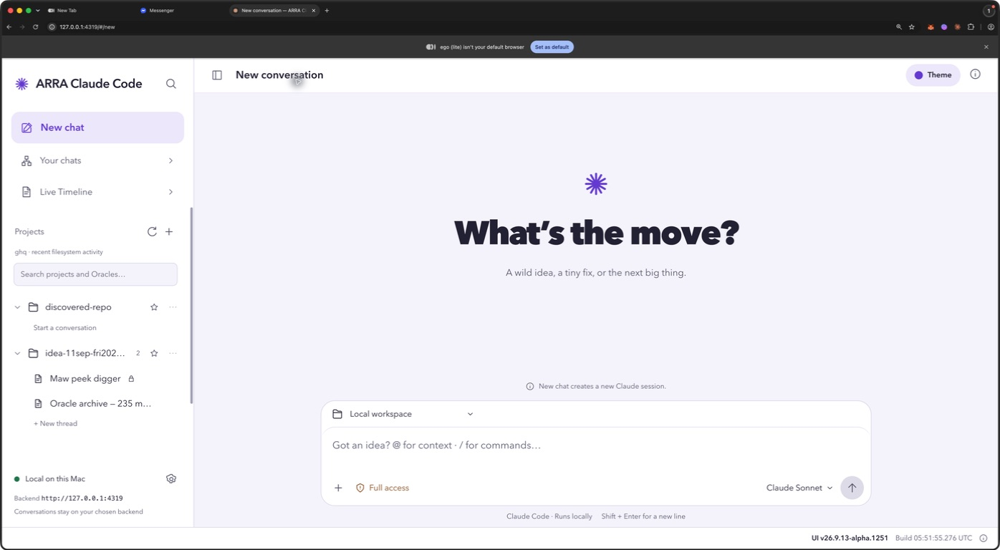

### 2. Choose Claude and permissions

Open **Claude model** in the composer. The available choices are **Claude Sonnet**, **Claude Opus**, and **Claude Haiku**. Select **Claude Haiku** for this example, then select **Default permissions** from **Permission mode**.

- **Expected result:** the composer displays the selected Claude model. There is no GLM provider selector or second-provider token field.
- The model screenshot below precedes the switch from the initial Full access setting to Default permissions.

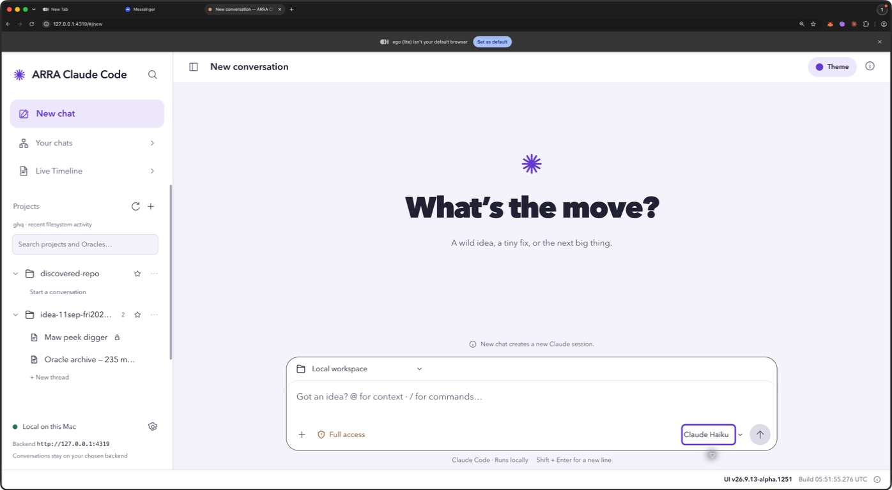

### 3. Send and inspect a reply

Enter `Plan a reliable Oracle workspace and summarize its session history.` and press **Enter**. Use **Shift+Enter** for a newline instead.

- **Expected result:** a new `#/chats/<chat-id>` route opens, the header shows a distinct Claude **Session** ID, and the fixture renders Markdown and a code block. The composer remains available for typing.
- Expand the token-usage disclosure. It separates uncached input, cache reads/writes, output, and estimated cost. These fixture numbers are not a real charge or context-window measurement.
- The fake reply is complete in this image; the separate history-sync indicator remains unresolved by design in this fixture.

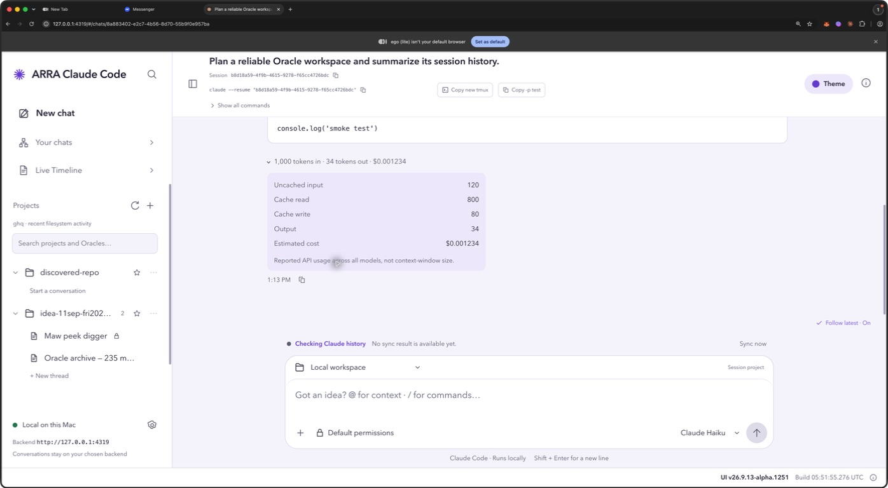

### 4. Suggest and save a display alias

Open the chat's **Rename display name** button, then **Suggest session names with AI**. Choose **Haiku** or **Sonnet** for the summary and select **Generate suggestions**. Select **Oracle workspace planning**, then **Save alias**.

- **Expected result:** **Display alias saved. Original session unchanged.** appears. The chat title changes, while its session ID and history stay intact.
- In the real backend, generation sends a bounded text excerpt to Claude and makes two charged, stateless, no-tools calls: Haiku/Sonnet summarizes, then Opus suggests three names. Nothing is renamed until you save.
- In this capture, both the summary and suggestions are fixed synthetic responses; no real model was called. You can also enter a name manually without generation.

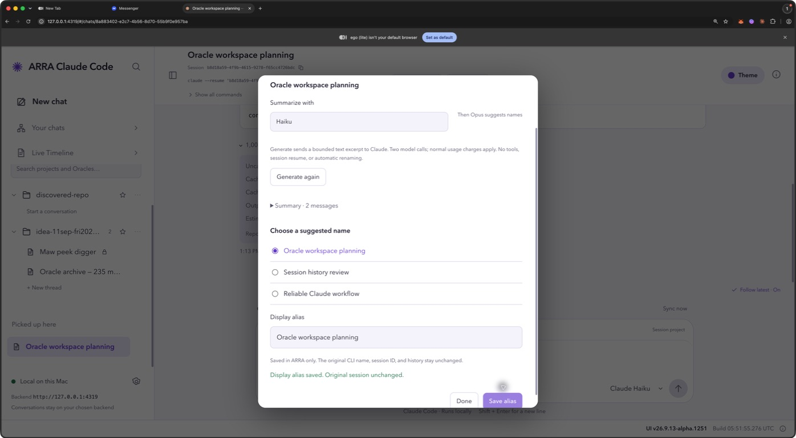

### 5. Expand the CLI commands

Close the naming dialog and select **Show all commands** beneath the session ID.

- **Expected result:** complete **Resume in terminal**, **New tmux**, and **One-shot sync test** commands become selectable. The compact header retains quick-copy buttons.
- Copying does not execute anything. Finish the existing Claude writer before running a resume, new tmux, or one-shot command. The one-shot command consumes quota and appends a turn when actually run.
- Full-access variants are explicitly dangerous: they bypass permission checks. The one-shot sync test keeps tools disabled.
- The unresolved sync badge below is the mock limitation described above, not a command failure.

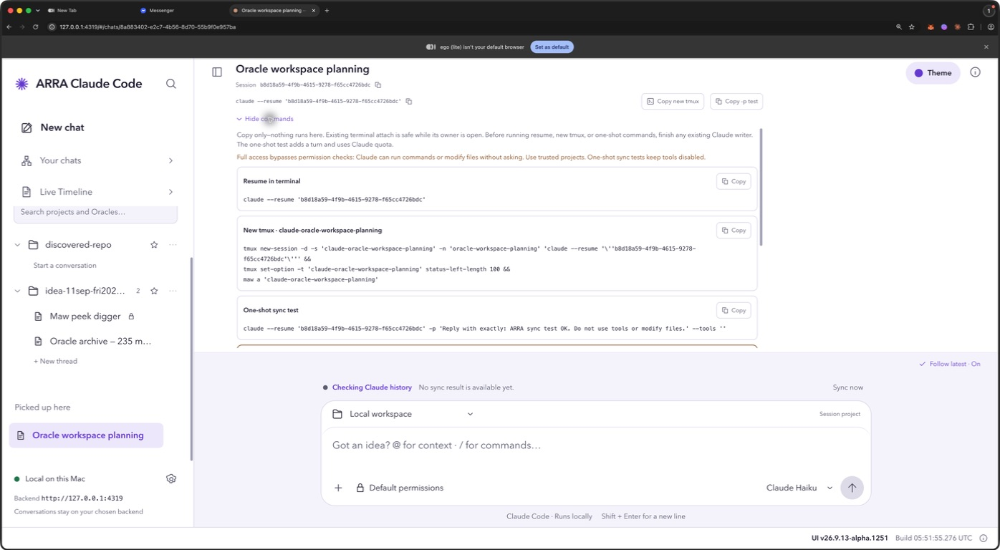

### 6. Reference a repository, Oracle, or session with `@`

Collapse the commands, focus the composer, and type `@oracle`. Choose **Oracle archive — 235 messages** with **Enter**.

- **Expected result:** autocomplete identifies sessions and repositories, then inserts a reference chip and a readable mention token without sending the prompt.
- References resolve names, IDs, and paths. **They do not automatically include the referenced conversation history.** Remove a chip using its remove button if it is not relevant.

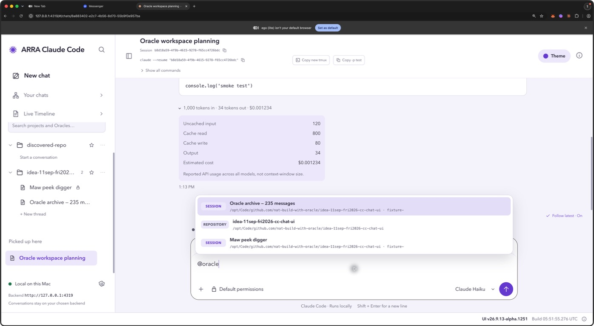

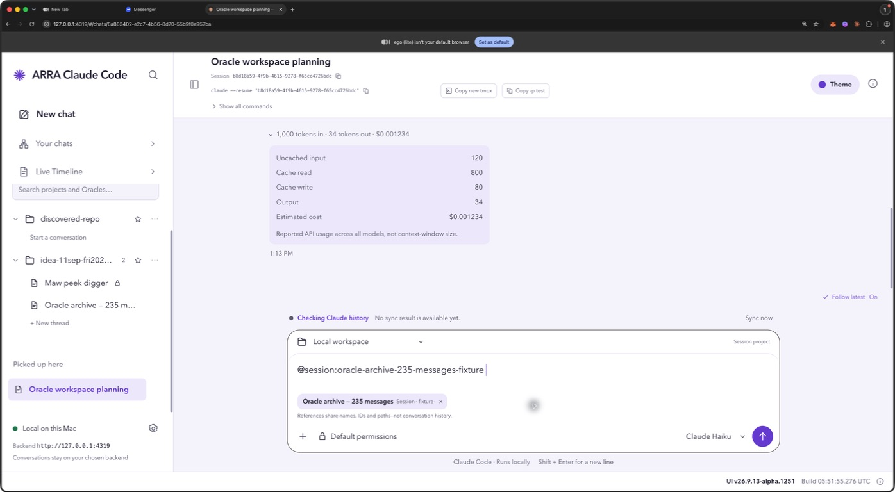

### 7. Discover slash actions

Clear the draft and type `/`.

- **Expected result:** the picker lists **/rename** and **/list-agents** as UI actions. These are not a promise that every interactive Claude CLI slash command works in the web composer.
- This step captured the suggestions without executing them. Press **Escape** to dismiss the picker.

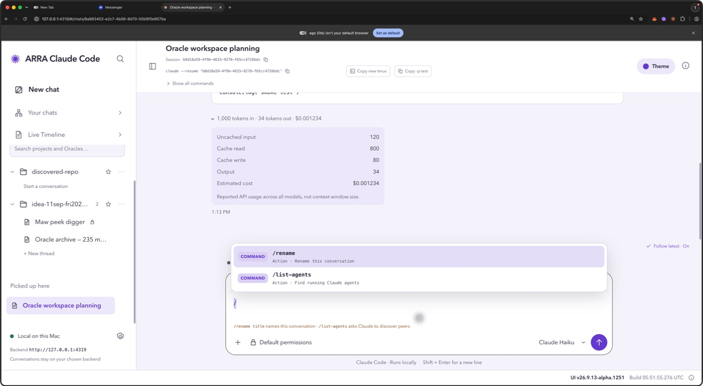

### 8. Stop an active response

Select **New chat**, send `wait`, and click **Stop Claude**.

- **Expected result:** the fixture stays running until stopped, then shows **Stopped by smoke fixture.** and a stopped-turn notice.
- This only stops the response owned by this chat; it is not a command to kill another terminal or tmux session.

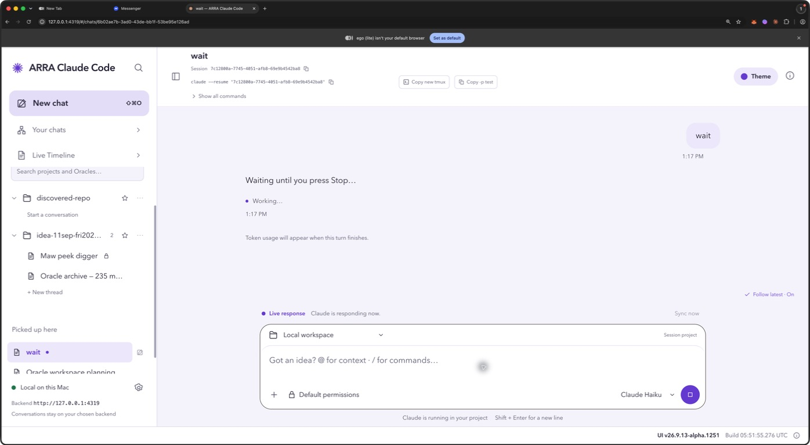

### 9. Find an Oracle with Command-K

For the disposable example, create an empty folder locally:

```sh
mkdir -p /tmp/arra-tutorial-demo-oracle
```

Use **Add project**, enter that **Folder path**, and select **Add project**. Click its star to add it to **Favorites**. Press **⌘K** (or **Ctrl+K**), enter `@oracle`, and choose the **Oracles** scope.

- **Expected result:** the folder ending in `-oracle` appears as **Oracle**. Press **Enter** on the result to open `#/new?project=<project-id>` with that project selected.
- macOS may display `/private/tmp/…` after resolving `/tmp/…`; both refer to this disposable folder.

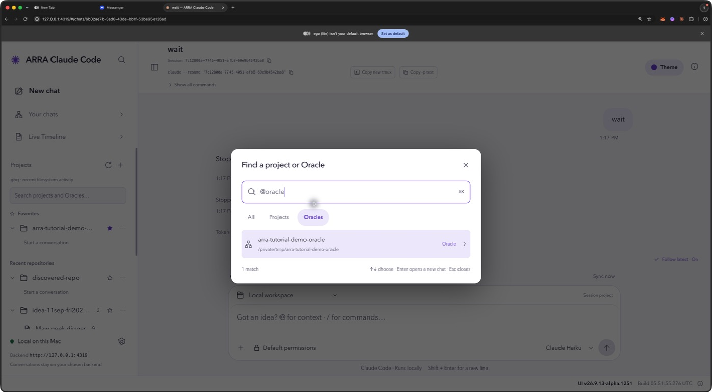

### 10. Sort threads inside a project

Open the project's **⋯** menu and select **Name A–Z**.

- **Expected result:** **Threads sorted by name** confirms the change. The same menu offers **Latest updated**, **Rename display name**, and **Hide from sidebar**. Sorting is per repository, not one global ordering for all session folders.
- The image shows the menu before selecting Name A–Z. Hiding was not executed during this tour.

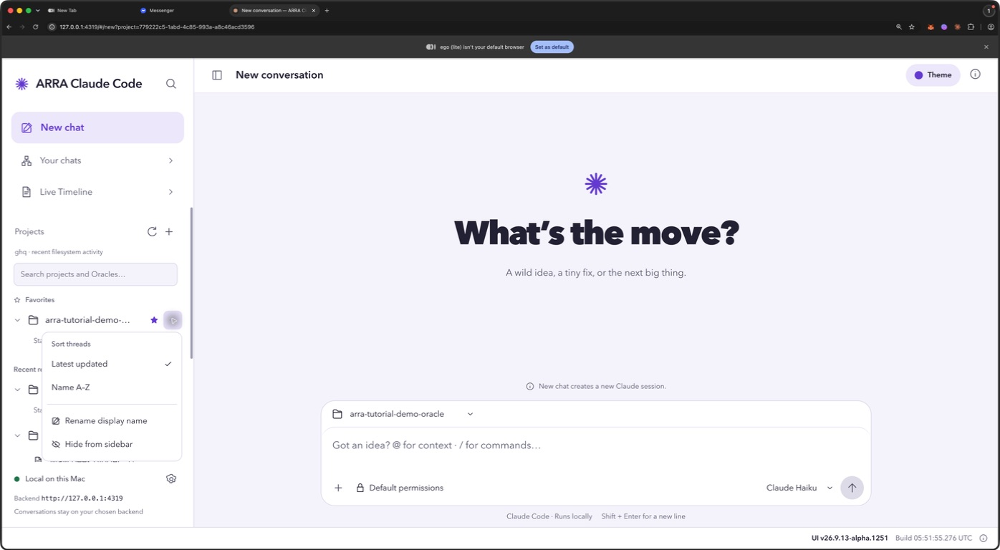

### 11. Browse the three native-session views

Select **Your chats**. Inspect **Agents**, then **Terminals**, then **Saved**.

- **Agents** at `#/sessions`: the fixture contains one working background agent. Its existing-terminal control copies a guarded attach command rather than silently creating another writer.

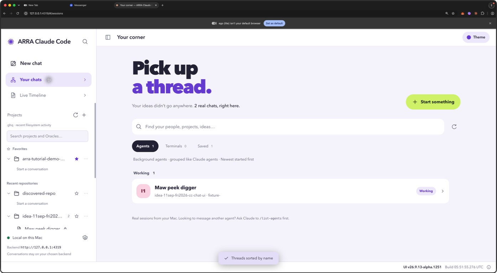

- **Terminals** at `#/sessions?tab=terminals`: the fixture intentionally contains no interactive terminal; the empty state is expected.

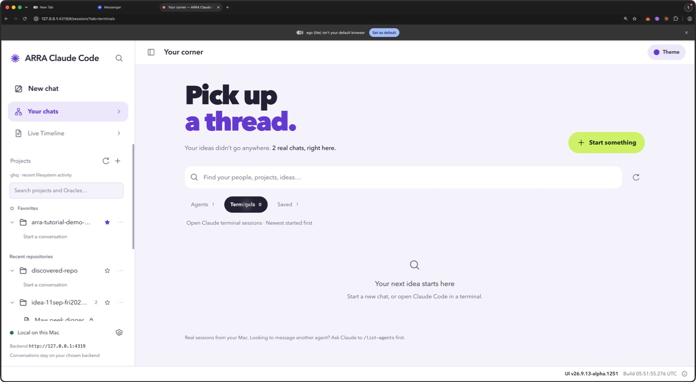

- **Saved** at `#/sessions?tab=saved`: the fixture contains the 235-message native archive.

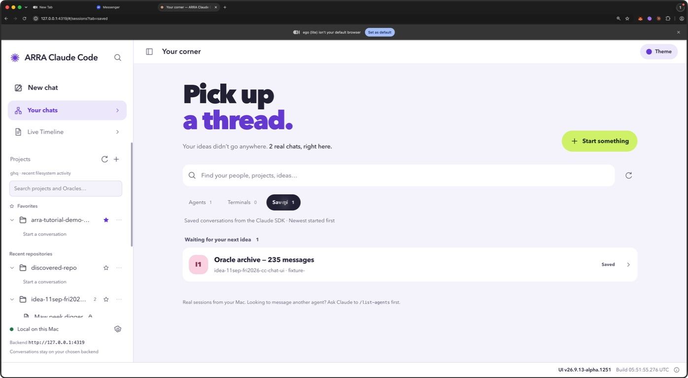

### 12. Load the entire available history

Open **Oracle archive — 235 messages**, then select **Load all remaining** instead of repeatedly selecting **Load more**.

- **Expected result:** `#/sessions/fixture-stopped-session?tab=saved` opens; loading ends with **All available history is loaded.** and **Historical request 235** at the bottom.
- Loading reads history; it does not send a new prompt or resume a CLI writer.

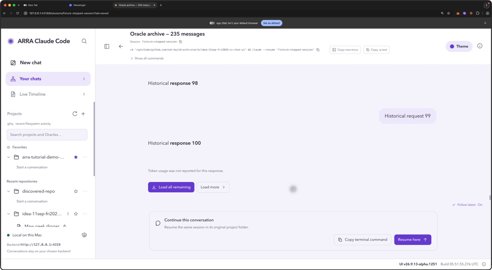

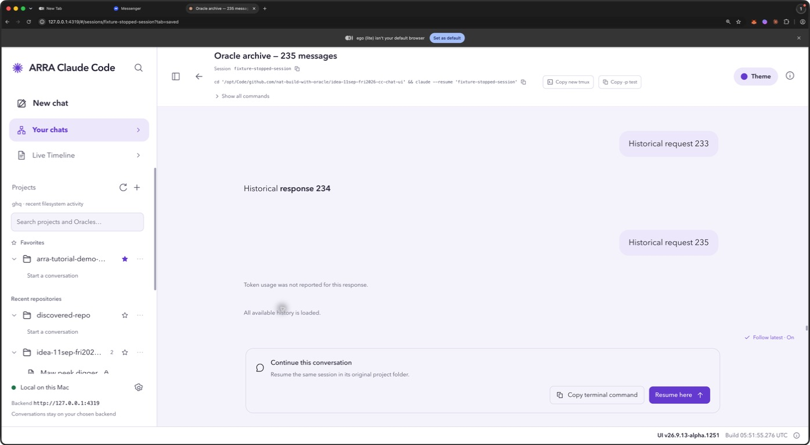

### 13. Control automatic scrolling

Select **Follow latest · On** to pause it, then scroll upward. Click the floating **Jump to bottom** button when ready to return.

- **Expected result:** the toggle reads **Follow latest · Paused** while you read older content. Jumping to the bottom restores **Follow latest · On** and returns to message 235.
- With following enabled, loading additional history moves to the newest message; pause it first when you want to keep reading earlier content.

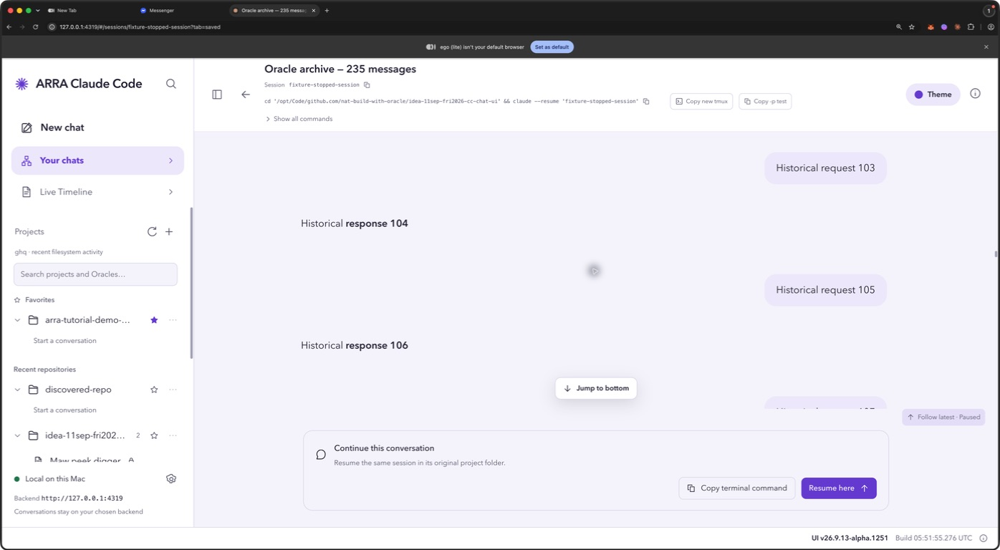

### 14. Inspect session details

Select **Session details** in the header.

- **Expected result:** the panel shows the project, working directory, full session ID, model provenance, and permission provenance. Native sessions show **From native session** and **Managed by native session**.
- **Set display alias** and **Export conversation** are visible. Export was not executed in this capture.

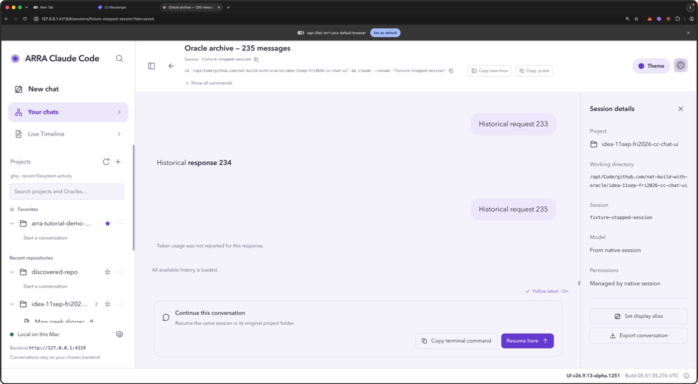

### 15. Check the selected backend

Close session details and select **Workspace settings** near **Local on this Mac**.

- **Expected result:** **Your local workspace** shows the backend address, workspace folder, and permission warnings. Here `smoke-fixture` identifies the fake CLI; it is not evidence of an authenticated real Claude account.
- The settings screenshot was recaptured in a separate fixture-only window to exclude unrelated tab titles.

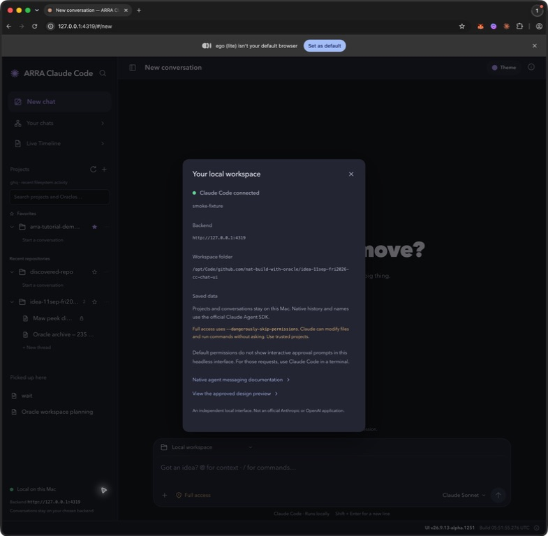

### 16. Adjust appearance

Return to **New chat**, open **Theme**, and select **Dark**.

- **Expected result:** the workspace changes to dark colors. **Pop**, **Light**, and **Reading size** remain available. These are interface preferences, not provider/model settings.

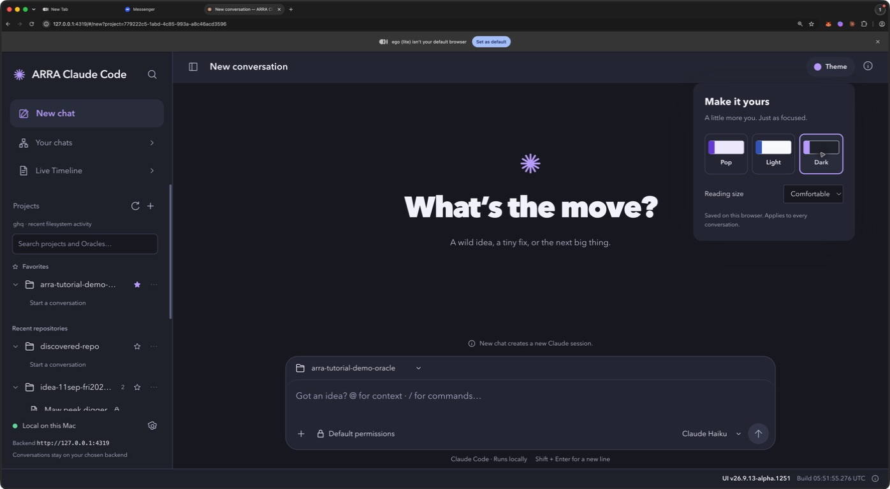

## Verify

- Your selected backend is visible in the sidebar.
- The real app offers only Claude Sonnet, Opus, and Haiku; legacy non-Claude conversations remain read-only rather than being migrated or deleted.
- A saved display alias does not change the full session ID.
- The long fixture reaches message 235 and **All available history is loaded.**
- **Jump to bottom** restores automatic following after manual history reading.

## External boundaries and troubleshooting

- **Live Timeline** leaves ARRA in the same browser tab. Its local service is on `http://127.0.0.1:47881/`; configured remote access uses the authenticated bridge described in [VPN access](../vpn-access.md). The Timeline service must already be running. The link was inspected but not followed in this tour, to avoid capturing personal timeline data. No Office/Timeline frontend was modified.
- **Not logged in / Please run /login** in the real app: complete Claude authentication yourself in a terminal. Use [the Claude-only updater](../claude-code-and-session-names.md) if an installed older GLM build is still running. The fixture cannot validate your account.
- **Checking Claude history** in this tour: expected because generated fake replies have no real JSONL transcript. Do not repeatedly retry sync for a fake generated ID; open a new fixture chat. Real sync requires an available native transcript.
- **An idle Claude terminal still holds this session**: use that existing terminal or exit its Claude process before writing here. History viewing is separate from writer ownership; do not start competing resumes.
- **Connection failed**: confirm the sidebar's exact host/port and that its backend is running. `4318` is the ordinary installed app; `4319` here is deliberately synthetic.

## Notes

- No model credentials, VPN unlock tokens, real message histories, or installed-app configuration were included in this tour.
- Browser screenshots describe the observed UI; they are not a claim that every external integration or native lifecycle was exercised in-browser. Automated checks and release limitations are recorded separately in the release notes.
- The original [earlier visual tutorial](using-claude-code-chat-ui.md) remains available for historical reference.
