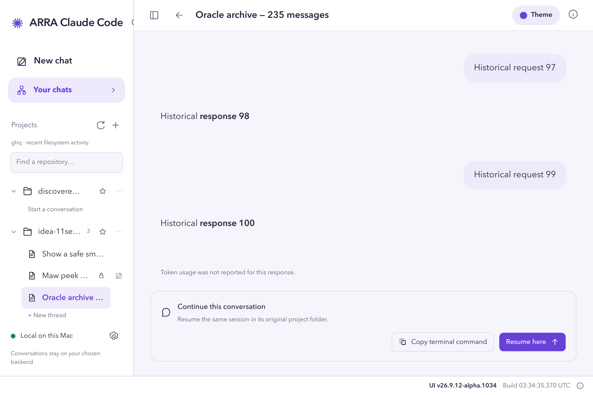
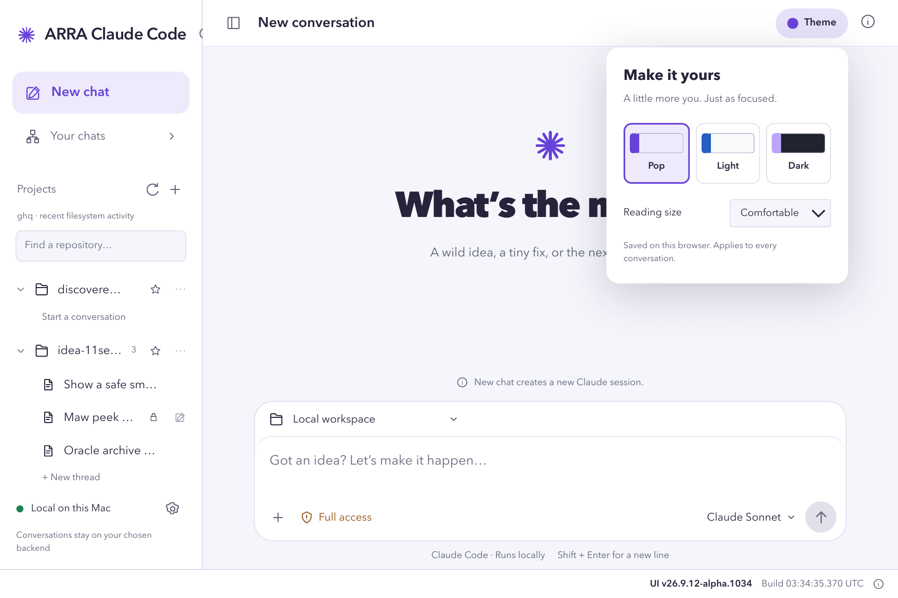
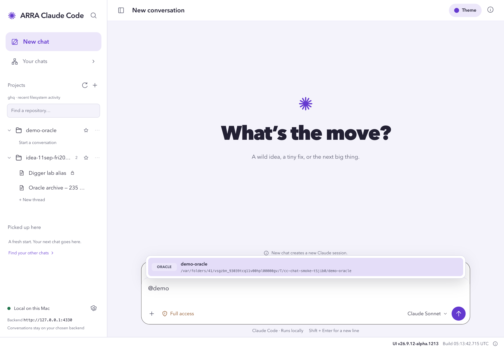
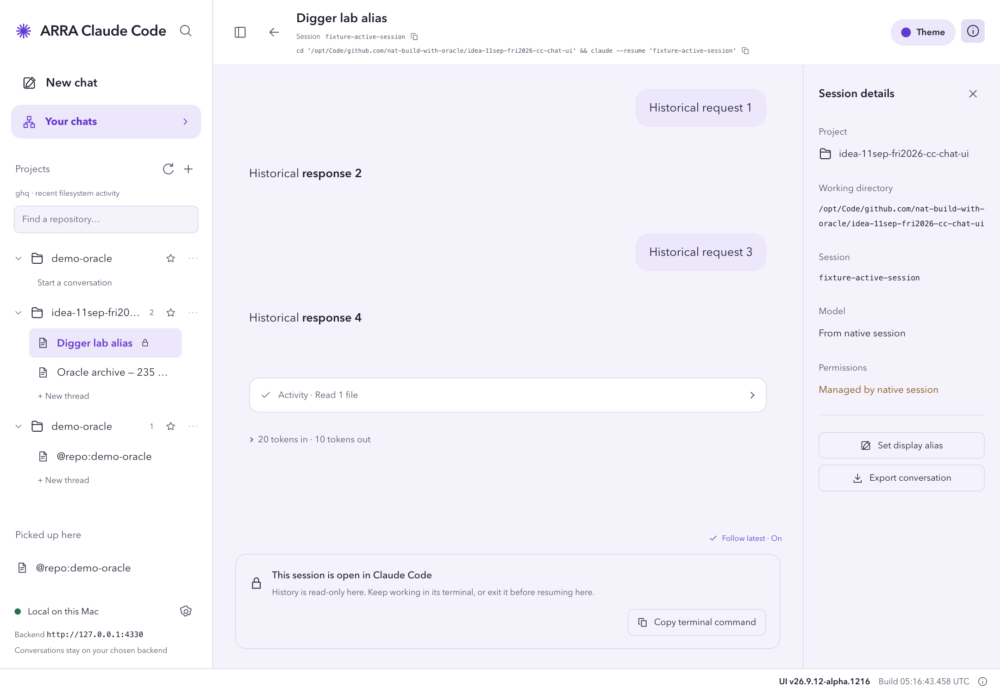

# Use ARRA Claude Code locally

For developers who want a browser UI for their existing Claude Code login, repositories, saved sessions, and streamed replies on a Mac.

## Before you begin

- Install Node.js supported by Vite 8.
- Install Claude Code and run `claude auth login`.
- Clone this repository, then run:

  ```sh
  npm ci
  npm run dev
  ```

- Open [http://127.0.0.1:5173/#/new](http://127.0.0.1:5173/#/new).
- Keep the local backend running. **Full access** uses `--dangerously-skip-permissions`; use it only with repositories you trust.

## 1. Start a conversation

Open **New chat** and choose a repository from **Conversation project**. A project is a repository; each conversation beneath it is a Claude session/thread.


Type a prompt and press **Enter** or select the arrow. Use **Shift + Enter** for a new line.

**Expected result:** the route changes from `#/new` to `#/chats/<chat-id>`, Claude streams its reply, and the thread appears under its project.

## 2. Read the reply and token usage

Completed replies show the token summary Claude reported. Select the summary to inspect uncached input, cache read/write, output, and estimated cost when those fields are available.


**Expected result:** the reply remains available after refresh. Missing usage is shown honestly as unavailable rather than estimated from the context window.

## 3. Organize repositories and threads

Use the star beside a repository to pin it under **Favorites**. Open the `…` menu to:

- sort that repository’s threads by **Latest updated** or **Name A–Z**;
- rename only its display label in this browser; or
- hide it from the sidebar without deleting the folder or its conversations.


Expand a repository and use the pencil beside a thread to rename that Claude session. Native session renames are written through the official Claude Agent SDK; repository display names remain browser-local preferences.

## 4. Find native Claude sessions

Select **Your chats**, then choose a source:

- **Agents** — background jobs grouped like `claude agents`;
- **Terminals** — interactive Claude processes still holding a session; or
- **Saved** — conversations loaded through the official Claude Agent SDK.


Search filters names, repositories, and session identifiers. The selected source and search are encoded in the URL, so Back, Forward, refresh, and copied links restore the same view.

## 5. Open or resume a saved session

Select a saved session to read it at `#/sessions/<session-id>?tab=saved`.

- **Resume here** imports the same native session into the app; it does not create a replacement identity.
- If Claude still owns the session in a terminal, continue there or exit that Claude process first. History remains readable and syncable while sending stays protected by the one-writer guard.
- **Copy terminal command** gives the exact `claude --resume <session-id>` command for the session’s original repository.

## 6. Load long conversation history

ARRA initially loads a bounded page so large transcripts open quickly. Select **Load more** for one page or **Load all remaining** for the rest.



While loading all pages, **Stop** safely keeps every page already received. **Follow latest** starts on and keeps the newest messages visible. Click it to pause while reading earlier history; the floating **Jump to bottom** resumes following.


**Expected result:** the final message is visible and the history control reports **All available history is loaded**.

## 7. Check Claude history sync

A resumed app chat shows its Claude transcript status above the composer:

- **Synced with Claude** — the latest stable SDK snapshot was reconciled.
- **Checking Claude history** — a read is in progress or no result exists yet.
- **Sync needs attention** — saved app messages were kept because the native snapshot was unavailable, changing, or could not be matched safely.

Select **Sync now** to force a fresh read. A successful retry shows **Claude history synced**. Built-in Claude slash-command output that is visible in the CLI but absent from the SDK transcript is preserved as an ARRA-only message instead of blocking the conversation.

## 8. Change the appearance

Open **Theme** in the top bar and choose a preset. Paper is the default; the selection stays in this browser.



## 9. Share Oracle context and keep native names intact

1. Type **@** in the composer and select a result. Folders ending in `-oracle` show **Oracle**; other folders show **Repository**. Session results include the native session ID and path.



2. Press **Enter** to select the reference, then send your message. The cursor returns to the composer. Only the selected name, path, and session ID metadata are shared—not the referenced conversation's history.
3. Open a native session → **Session details** → **Set display alias** → **Save name**. Refresh: the alias remains, while the native name, ID, and history stay unchanged. This works even with its terminal open.
4. Click the **Session** ID or the CLI command underneath to copy it. The command includes the known project folder. Copying does not run it; finish any existing native writer before resuming that session.



**Follow latest · On** follows rendered replies and tool output automatically. Click it to pause; **Jump to bottom** turns following back on.

*Observed 12 September 2026 with isolated smoke fixtures; screenshots contain no real conversation history. Port 4330 is the temporary test backend, not the default port.*

## Verify

1. Refresh the current `#/chats/...` or `#/sessions/...` URL.
2. Use browser Back and Forward.
3. Confirm the same project, thread, native-source tab, and loaded conversation return without sending another prompt.

## Troubleshooting

- **`ERR_BLOCKED_BY_CLIENT` in Comet** — turn **Block ads and trackers** off for this site only, reload, and restore it if that does not help. See [the Comet shield guide](../cloudflare.md#quick-per-site-fix-the-shield-menu).
- **Hosted UI cannot reach `127.0.0.1:4318`** — keep the backend running, allow the site’s local-network prompt, and verify the `?host=http://127.0.0.1:4318` URL. See [Cloudflare setup and security](../cloudflare.md).
- **Claude Code was not found** — confirm `claude --version` and `claude auth login`, then restart the app.
- **Native session is still open** — use its terminal or exit that process before sending from ARRA. Do not run two writers against one Claude session.
- **Sync needs attention** — wait for an active CLI write to finish, select **Sync now**, and read the visible result. ARRA never deletes saved messages during a failed reconciliation.

## Notes

- Interface observed on 2026-09-12.
- Full-page screenshots were captured from the repository’s isolated smoke fixture at `127.0.0.1:4319`; no personal conversations, credentials, or production writes were used.
- Conversation data and execution stay on the selected local backend. Claude Code still contacts Anthropic.
